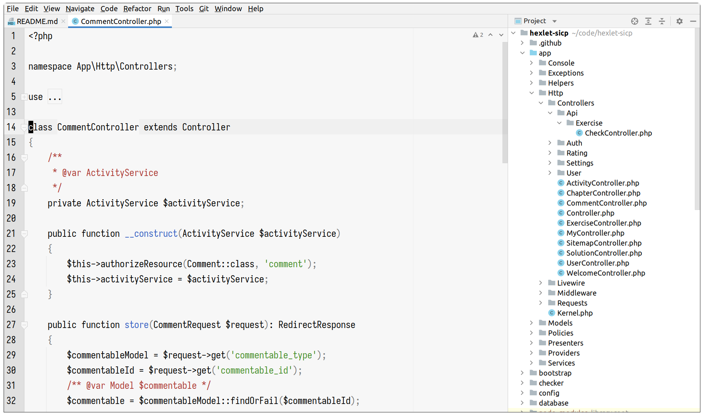

# PHPStorm Alabaster
Цветовая схема с минимальным подсвечиванием цветом.

Является портированием [темы от tonsky](https://github.com/tonsky/sublime-scheme-alabaster).

## TODO
- Добавить оставшиеся языки в настройках PHPStorm
- Инструкция по установке
- Написать об отличиях с оригиналом
- Добавить тёмную и монохроматические темы
- Опубликовать в Jetbrains Plugins?